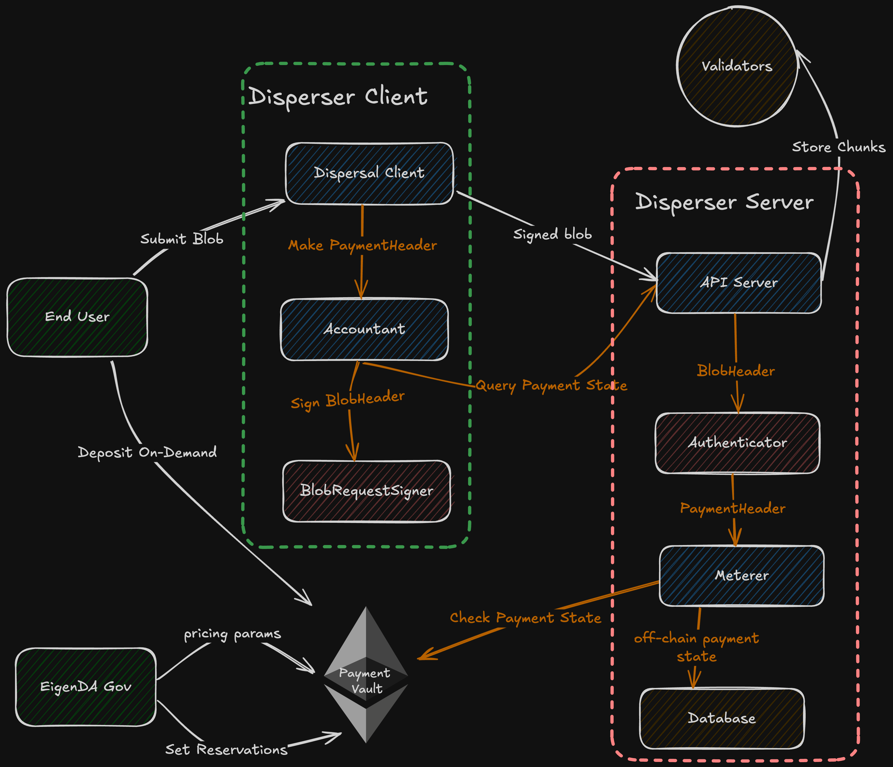
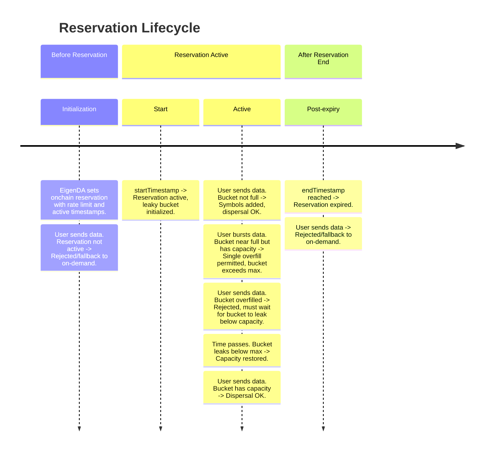
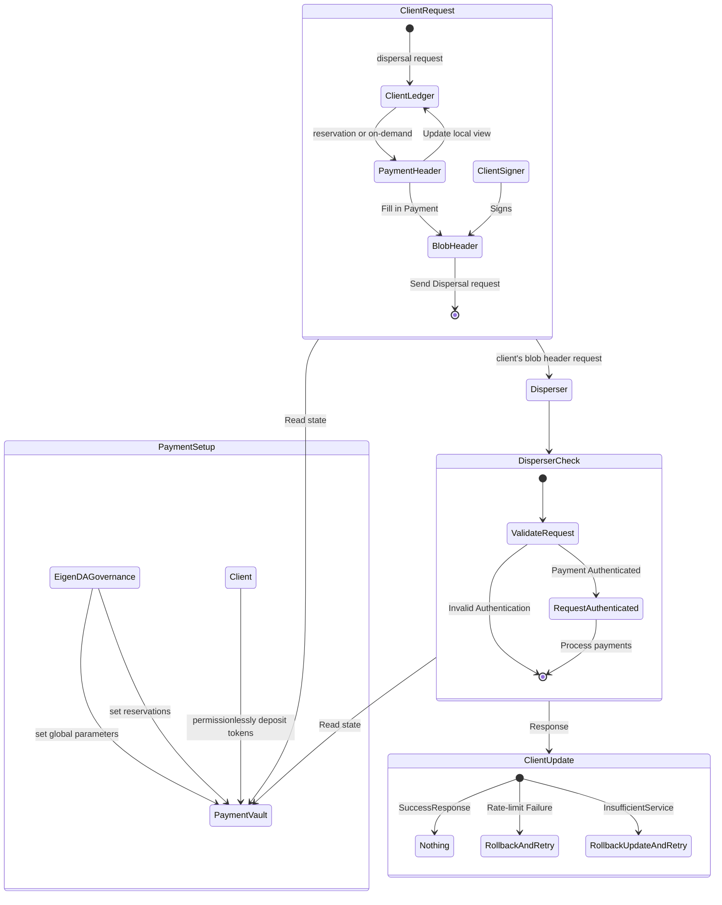

# Payments

The Payments system streamlines user interactions with EigenDA, offering clear, flexible options for managing network
bandwidth. EigenDA supports two flexible payment modalities:

1. **On-demand Bandwidth**: Users are charged per blob dispersal request for occasional bandwidth usage without time
   limitations or throughput guarantees. Charges are applied only when the request is successfully validated by the
   disperser server, providing flexibility for users with dynamic bandwidth requirements. 

2. **Reserved Bandwidth**: Users can reserve bandwidth for a fixed time period by pre-paying for system capacity, ensuring consistent and reliable throughput at discounted prices.

The system supports transparent pricing and metering through a centralized disperser, which handles both accounting and metering. The current design assumes trust in the disperser to allow efficient allocation and distribution of bandwidth.

## Design Goals

The overall goal of the payments upgrade is to introduce flexible payment modalities to EigenDA in a manner that can be gracefully extended in order to support permissionless dispersal to the EigenDA validator network.

### On-Demand Bandwidth

On-demand bandwidth allow users to make occasional, pre-paid payments and get charged per blob request, without specific
time limitations or throughput guarantees. This approach is ideal for users with unpredictable bandwidth needs. Through
the `PaymentVault` contract, users can deposit funds via the `depositOnDemand` function. Charges are only applied once
the dispersal request is successfully processed, offering a flexible and efficient solution for dynamic bandwidth usage
patterns.

On-demand payments are currently supported only through the EigenDA Disperser. Users can retrieve their current
on-demand balance from the disperser, enabling them to monitor their available funds effectively and plan for future
bandwidth usage.

### Reserved Bandwidth

Reserved bandwidth provide customers with consistent bandwidth over a defined period. The EigenDA `PaymentVault`
contract maintains a record of existing reservations, with each reservation specifying the bandwidth allowance, period
of applicability, etc.

Once a reservation is created onchain, it can be updated through the `setReservation` function in the contract. This
function is called by EigenDA governance to manage and maintain reservations for users.

During a reservation's period of applicability, a user client can send a dispersal request authenticated by an account
associated with one of these reservations. Such requests are subject to a leaky bucket rate limiting algorithm, which
fills with symbols as blobs are dispersed and leaks symbols over time at the reservation rate. Requests are accepted as
long as the bucket has available capacity.

## High-level Design

The payment system consists of the following components: 

- **Users**: Deposit tokens permissionlessly for on-demand payments and/or negotiate reservations with the EigenDA
  team
- **EigenDA Client**: Users run a client instance to submit data for dispersal and manage payments. (This client is
  integrated into the EigenDA proxy)
- **Disperser Server**: Responsible for dispersing data and tracking on-demand payment usage.
- **Validator Nodes**: The source of truth for reservation metering, tracking reservation usage via leaky bucket rate
  limiting.
- **Payment Vault**: Onchain smart contract for on-demand payments and managing reservations.
- **EigenDA Governance**: The EigenDA governance wallet manages the payment vault global parameters and reservations.




To initiate a dispersal, the EigenDA client sends a dispersal request containing a payment header to the disperser,
which validates the payment information. For on-demand payments, the disperser tracks usage and validates against
deposits in the PaymentVault contract. For reservation payments, validator nodes serve as the source of truth, tracking
each account's reservation usage using leaky bucket rate limiting. Clients can query the disperser to retrieve their own
offchain state for on-demand usage information.

## Low-level Specification

### On-Demand Bandwidth (On-Demand Payments)

On-demand payments are supported only through the EigenDA Disperser, which tracks usage and validates payments.

Requests created by the disperser client contain a `BlobHeader`, which contains a `PaymentMetadata` struct as specified
below. 

```go
// PaymentMetadata represents the payment information for a blob
type PaymentMetadata struct {
  // AccountID is the ETH account address for the payer
  AccountID string
  // Timestamp represents the nanosecond of the dispersal request creation (serves as nonce)
  Timestamp int64
  // CumulativePayment represents the total amount of payment (in wei) made by the user up to this point.
  // If empty/zero → reservation payment
  // If non-zero → on-demand payment
  CumulativePayment *big.Int
}
```

On-demand bandwidth users must first deposit tokens into the payment vault contract for a particular account, in which
the contract stores the total payment deposited to that account (`totalDeposit`). Users should be mindful in depositing
as they cannot withdrawal or request for refunds from the current Payment Vault contract. Users can retrieve their
current on-demand balance from the disperser by calling the `GetPaymentState` gRPC endpoint.

```solidity
// On-chain record of on-demand payments
struct OnDemandPayment {
  // Number of tokens ever deposited; this value can only increase
  uint80 totalDeposit;
}
```

All on-demand payments share global parameters including the global symbols per second (`globalSymbolsPerSecond`), global rate interval (`globalRatePeriodInterval`), minimum number of symbols per dispersal (`minNumSymbols`), and the price per symbol (`pricePerSymbol`).

```solidity
/* Constant parameters set by EigenDA governance */
// Minimum number of symbols charged for each dispersal request; 
// The dispersal size gets round up to a multiple of this parameter
uint64 _minNumSymbols,
// Number of wei charged per symbol for on-demand payments
uint64 _pricePerSymbol,
// Minimum number of seconds between minNumSymbols or pricePerSymbol updates
uint64 _priceUpdateCooldown,
// Number of symbols for global on-demand payments; works similarly as a reservation
uint64 _globalSymbolsPerPeriod,
// Number of seconds for global on-demand ratelimit measurement; works similarly as a reservation
uint64 _globalRatePeriodInterval
// This function is called by anyone to deposit funds for a user address for on demand payment
function depositOnDemand(address _account) external payable;
```

When a disperser client disperses blobs with on-demand bandwidth, the client calculates the payment amount based on the
blob size, `pricePerSymbol`, and `minNumSymbols`. The client includes a `CumulativePayment` field in the payment
header, which represents the client's local calculation of total cumulative cost. However, the disperser validates
payments by tracking each account's usage independently in its own database, comparing total usage against the
account's on-chain deposits in the PaymentVault. Though the cumulative payment value claimed by the client is not
currently considered by the disperser when determining if a payment is valid, the field is still populated accurately
by clients, since the value may be used in the future. The disperser also enforces a global rate limit on on-demand 
payments.

Example: Initially, EigenDA team will set the price per symbol to be `0.4470gwei`, aiming for the price of `0.015ETH/GB`, or `2000gwei/128Kib` blob dispersal. We limit the global on-demand rate to be `131072` symbols per second (`4mb/s`) and 30 second rate intervals; this allows for ~4 MiB of data to be dispersed every second on average, and the maximum single spike of dispersal to be ~120MiB over 30 seconds.

### Reserved Bandwidth (Reservations)

Each dispersal request includes the same `PaymentMetadata` struct shown earlier. The payment type is determined by the
`CumulativePayment` field: if empty/zero, it's a reservation payment; if non-zero, it's an on-demand payment. For
reservation payments, the `Timestamp` field serves as a nonce.

Users would reserve some bandwidth by setting a reservation onchain, to signal offchain disperser to reserve dedicated bandwidth for the user client. The reservation definition contains the reserved amount (`symbolsPerSecond`), reservation start time (`startTimestamp`), end time (`endTimestamp`), allowed custom quorum numbers (`quorumNumbers`), and corresponding quorum splits (`quorumSplits`) that will be used for payment distribution in the future. 

```go
// On-chain record of reservations
struct Reservation {
  // Number of symbols reserved per second
  uint64 symbolsPerSecond; 
  // timestamp of when reservation begins (In seconds)
  uint64 startTimestamp;
  // timestamp of when reservation ends (In seconds)
  uint64 endTimestamp;
  // quorum numbers in an ordered bytes array, allow for custom quorums
  bytes quorumNumbers;
  // quorum splits in a bytes array that correspond to the quorum numbers, for reward distribution
  bytes quorumSplits;
}
```

All reservations share global parameters including the reservation interval (`reservationPeriodInterval`) and minimum number of symbols per dispersal (`minNumSymbols`).

```solidity
/* Constant parameters set by EigenDA governance */
// Minimum number of symbols charged for each dispersal request; 
// The dispersal size gets rounded up to a multiple of this parameter
uint64 _minNumSymbols,
// Minimum number of seconds between minNumSymbols (and pricePerSymbol) updates
uint64 _priceUpdateCooldown,
// Number of seconds for each reservation ratelimit measurement
uint64 _reservationPeriodInterval,
// This function is called by EigenDA governance to store reservations
function setReservation(
  // user's address
  address _account,
  // reservation object as specified above 
  Reservation memory _reservation
);
```

The `symbolsPerSecond` reservation rate determines how quickly the leaky bucket drains. A symbol is defined as 32 bytes
and is measured by the length of the erasure coded blob. The bucket capacity is determined by the reservation rate
multiplied by a configured duration (currently 60 seconds). This controls the maximum burst size. When a blob is
dispersed, its symbol count is added to the bucket, and symbols continuously leak out at the reservation rate. Validator
nodes track reservation usage as the authoritative source of truth, while clients maintain their own local bucket state.
If the bucket is full, requests will be rejected until sufficient symbols have leaked out. Clients can optionally fall
back to on-demand payments when reservation capacity is temporarily exhausted.

Example: If you have a reservation with 100 symbols per second, given the current 60-second bucket duration, your
bucket capacity is 6,000 symbols (100 * 60). You can burst up to ~187 KiB (6,000 symbols * 32 bytes), after which you
must wait for symbols to leak out at 100 symbols/second before making additional dispersals.

#### Leaky Bucket Overfill

The leaky bucket implementation permits a single overfill to accommodate edge cases with small reservations:

- If a client has *any* available capacity remaining in their bucket, they may make a single dispersal up to the maximum
  blob size, even if that dispersal causes the bucket to exceed its maximum capacity.
- When this happens, the bucket level goes above the maximum capacity, and the client must wait for the bucket to leak
  back down below full capacity before making the next dispersal.
- This feature solves a problem with small reservations: without overfill, a reservation might be so small that its
  total bucket capacity is less than the maximum blob size, which would prevent users from dispersing maximum-sized
  blobs.
- By permitting a single overfill, even the smallest reservation can disperse blobs of maximum size.

Below we provide a timeline of the reservation lifecycle.



### Disperser Client requirements



A client has their specific reservation parameters set onchain, including start/end timestamps and symbols per second
rate. The client maintains a local leaky bucket to track reservation usage, filling it as blobs are dispersed and
allowing it to leak at the reservation rate. Clients use this locally tracked payment state to decide what type of
payment to use for each dispersal.

If a client's reservation bucket is temporarily full, the client can either wait for symbols to leak out, or switch to
on-demand payments. The EigenDA client implementation can be configured to automatically fall back to on-demand payments
when the reservation bucket is full. For on-demand payments, the cumulative payment field is incremented by the blob
cost. The disperser validates on-demand requests by checking if the account's total cumulative usage exceeds their
on-chain deposits in the PaymentVault, or if the global rate limit is hit. If either condition is true, the request
will be rejected.
