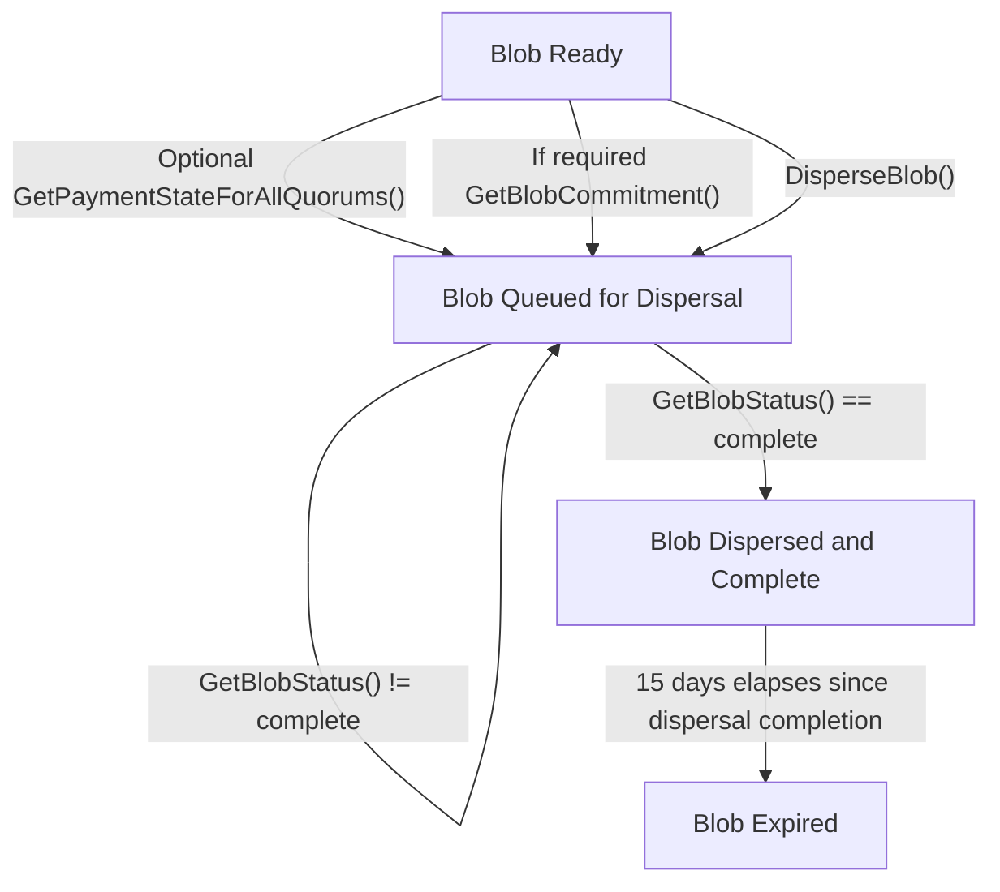

The EigenDA disperser provides the v2 API for:
* Dispersing and retrieving blobs to and from the EigenDA network in an untrusted fashion. 
* [Flexible payment modalities: on-demand and reserved bandwidth](https://docs.eigencloud.xyz/products/eigenda/core-concepts/payments).

:::note
As part of its essential data availability guarantee, the EigenDA network already supports direct communication with 
the EigenDA network for blob retrieval; permissionless dispersal of blobs to the EigenDA network is planned for a future protocol
upgrade in later 2025.
:::

The source of truth for the Disperser v2 API spec is [disperser.proto](https://github.com/Layr-Labs/eigenda/blob/v0.9.0/api/proto/disperser/v2/disperser_v2.proto), adjusted to the current release. 
The goal of this document is to explain this spec at a higher level.

<!-- TODO: Update network pages -->

Eigen Labs hosts one v2 disperser endpoint for each EigenDA network. These endpoints are documented in respective network pages 
for [mainnet](../../networks/mainnet.md), [Holesky](../../networks/holesky.md), and [Sepolia](../../networks/sepolia.md).

The EigenDA Disperser exposes the following v2 endpoints:

* `DisperseBlob()`
* `GetBlobStatus()`
* `GetBlobCommitment()`
* `GetPaymentStateForAllQuorums()`
* `GetPaymentState()`

:::note
`GetPaymentSate()` is deprecated. Use `GetPaymentStateForAllQuorums()`.
:::

These endpoints enable the blob lifecycle, from enqueuing blobs for dispersal to waiting for their dispersal finalization
and finally to retrieving blobs from the EigenDA network. The following flowchart describes how move blobs through this lifecycle
with respect to these endpoints:

The Disperser offers an asynchronous API for dispersing blobs, where clients poll the `GetBlobStatus()` endpoint with 
the dispersal request ID they received from calling the `DisperseBlob()` endpoint until the disperser reports the blob as 
successfully dispersed and complete.

:::note
The `GetBlobStatus()` response includes the relay keys and a mapping from relay key to relay URL. Fetch the relay URL from
onchain as it is required rather than hard coding the current relay URL. 
:::

<!-- TODO: Add v2 updates and significant differences from v1 -->

## Endpoints

Here we provide a narrative-level description of the major API endpoints. Please see [the repo](https://github.com/Layr-Labs/eigenda/blob/v0.9.0/api/proto/disperser/v2/disperser_v2.proto) adjusted to the current release, for detailed, field-level API documentation.