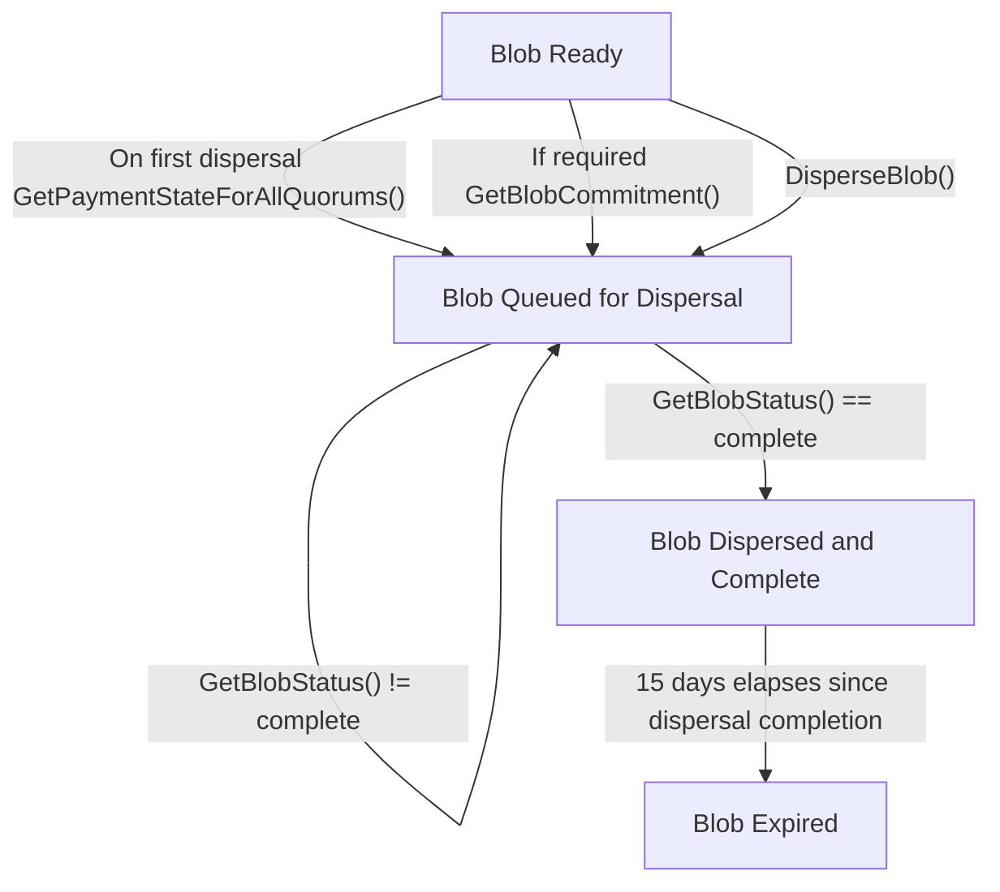

## Dispersing Blobs

The EigenDA v2 Disperser provides an API for:
* Dispersing blobs to the EigenDA network. 
* [Flexible payment modalities: on-demand and reserved bandwidth](https://docs.eigencloud.xyz/products/eigenda/core-concepts/payments).

:::note
As part of its essential data availability guarantee, the EigenDA network supports direct communication with 
the EigenDA validators for blob retrieval; permissionless dispersal of blobs to the EigenDA network is planned for a future protocol
upgrade in later 2025.
:::

The low level specification for the Disperser v2 API spec is [disperser.proto](https://github.com/Layr-Labs/eigenda/blob/v0.9.0/api/proto/disperser/v2/disperser_v2.proto), adjusted to the current release. 
The goal of this document is to explain this spec at a higher level.

<!-- TODO: Update network pages -->

Eigen Labs hosts one v2 disperser endpoint for each EigenDA network. These endpoints are documented in respective network pages 
for [mainnet](../../networks/mainnet.md), [Holesky](../../networks/holesky.md), and [Sepolia](../../networks/sepolia.md).

### Disperser Endpoints

The EigenDA v2 Disperser exposes the endpoints:

* `DisperseBlob()`
* `GetBlobStatus()`
* `GetBlobCommitment()`
* `GetPaymentStateForAllQuorums()`

:::note
`GetPaymentSate()` is deprecated. Use `GetPaymentStateForAllQuorums()`.
:::

### Blob Dispersal Lifecycle

These endpoints enable the blob dispersal lifecycle, from enqueuing blobs for dispersal, to waiting for a DA certificate that meets the
client requested quorum thresholds. The Disperser offers an asynchronous API for dispersing blobs, where clients poll the `GetBlobStatus()` endpoint with
the blob key they received from calling the `DisperseBlob()` endpoint until the disperser reports the blob as
successfully dispersed and complete.

The following flowchart describes how move blobs through this lifecycle with respect to these endpoints:

:::note
The `GetBlobStatus()` response includes the relay keys. Fetch the relay URL from
[onchain in the `EigenDARelayRegistry`](https://github.com/Layr-Labs/eigenda/blob/a6e6a31474caf73f2994301567dc0e64d6ac2e80/contracts/src/core/EigenDARelayRegistry.sol#L32) contract as it is required rather than hard coding the current relay URL. 
:::

:::tip
Here we provide a narrative-level description of the major API endpoints. Please see [the repo](https://github.com/Layr-Labs/eigenda/blob/v0.9.0/api/proto/disperser/v2/disperser_v2.proto) adjusted to the current release, for detailed, field-level API documentation.
:::

## Retrieving Blobs

Blobs can be retrieved from:
* Relays
* Validators. 

Generally it will be faster and easier to retrieve the unencoded blob directly from a relay, and end users should first 
attempt to retrieve data from a relay. Retrieving from a relay requires less bandwidth and computation, and has a higher capacity
and lower average latency than retrieving from a validator. If all relays in possession of a blob go down or are maliciously withholding the data, the validators nodes are a reliable way
to fetch the data (as only a fraction of the chunks distributed to validator nodes are needed to reconstruct the original data).

### Relay Endpoints

 The EigenDA Relay exposes the endpoints:
 * `GetBlob()`
 * `GetChunks()`

:::tip
Here we provide a narrative-level description of the major API endpoints. Please see [the repo](https://github.com/Layr-Labs/eigenda/blob/master/api/proto/relay/relay.proto) adjusted to the current release, for detailed, field-level API documentation.
:::

### Validator Endpoints 

The EigenDA Node exposes the retrieval endpoints: 
* `RetrieveChunks()`
* `GetBlobHeader()`
* `NodeInfo()`

:::tip
Here we provide a narrative-level description of the major API endpoints. Please see [the repo](https://github.com/Layr-Labs/eigenda/blob/v0.9.1/api/proto/node/node.proto) adjusted to the current release, for detailed, field-level API documentation.
:::
