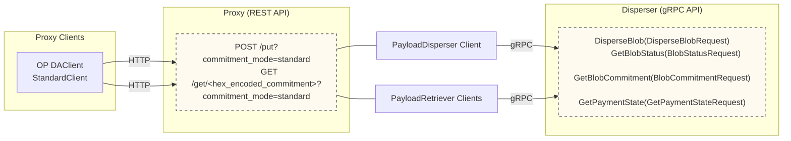

To disperse and retrieve payloads, there are three options:
1. Run a proxy server and use the [REST API](https://github.com/Layr-Labs/eigenda-proxy?tab=readme-ov-file#rest-api-routes).  This is the simplest option to implement. 
2. Use the [golang](https://github.com/Layr-Labs/eigenda/blob/master/api/clients/disperser_client.go) or [rust](https://github.com/Layr-Labs/eigenda-client-rs) client with the gRPC API and onchain interfaces. 
3. Write your own client to use with the gRPC API and onchain interfaces.

:::note
Advanced usecases might require using the clients directly (that is, option 2 or 3 above). For example, ZKsync prefered to 
keep their [ZK Stack](./rollup-guides/zksync/README.md) sequencer as a single binary and didn't want to have to spin up a sidecar process for the proxy. 
So they opted to integrate with our rust client directly in their DA dispatcher code. For most users, we recommend 
making use of the EigenDA proxy. This is how [Arbitrum Nitro](./rollup-guides/orbit/overview.md)and [Op Stack](./rollup-guides/op-stack/README.md) integrations work.
:::

The below diagram documents the different ways to interface with the EigenDA disperser.

## Proxy with REST API

The [EigenDA Proxy](./eigenda-proxy/eigenda-proxy.md) is a proxy server that can be spun up to provide a simple REST API to simplify interacting with the EigenDA
Network. It handles the payment state, blob status polling, and cert verification for you, and provides a simple interface for
dispersing and retrieving blobs. We recommend most users make use of the proxy, as it simplifies the integration process significantly.

## Clients 

We provide [golang](https://github.com/Layr-Labs/eigenda/tree/master/api/clients) and [rust](https://github.com/Layr-Labs/eigenda-client-rs) clients to simplify the integration process.

## gRPC API

The EigenDA Disperser provides a gRPC API with 4 RPC methods. See the [protobuf definitions](https://github.com/Layr-Labs/eigenda/blob/master/api/proto/disperser/v2/disperser_v2.proto) 
for full details. This API is asynchronous and requires managing payment state and polling for blob status, until a cert is available. 
Furthermore, a payload must be encoded into an EigenDA blob before it can be dispersed (see the [V2 integration spec](https://layr-labs.github.io/eigenda/integration.html) for full details). 

