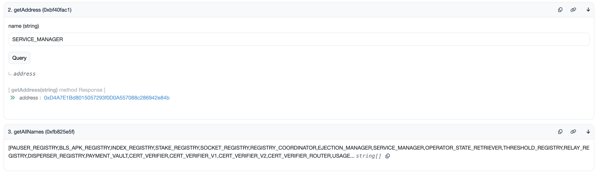

# Holesky

The EigenDA Holesky testnet is the EigenDA testnet for operators.

## Quick Links

* [AVS Page][2]
* [Blob Explorer V1][1]
* [Blob Explorer Blazar (V2)][4]
* [Deployed Contract Addresses][3]

## Specs

| Property | Value |
| --- | --- |
| Disperser Address | `disperser-holesky.eigenda.xyz:443` |
| Churner Address | `churner-holesky.eigenda.xyz:443` |
| Batch Confirmation Interval (V1) | Every 10 minutes (may vary based on network health) |
| Max Blob Size | 16 MiB |
| Default Blob Dispersal Rate limit | No more than 1 blob every 100 seconds |
| Default Blob Size Rate Limit | No more than 1.8 MiB every 10 minutes |
| Stake Sync (AVS-Sync) Interval | Every 24 hours |
| Ejection Cooldown Period | 24 hours |

## Contract Addresses

| Contract | Address |
| --- | --- |
| EigenDADirectory | [0x90776Ea0E99E4c38aA1Efe575a61B3E40160A2FE](https://holesky.etherscan.io/address/0x90776Ea0E99E4c38aA1Efe575a61B3E40160A2FE) |

All other contracts are now tracked inside the EigenDADirectory contract:
1. Click on the etherscan link above.
2. Click on the "Contract" button.
3. Click on the "Read as Proxy" button.
4. Click on "getAllNames()" function to see the name of all registered contracts.
5. Use the "getAddress()" function to get the address of a specific contract, using its name.

## Quorums

| Quorum Number | Token |
| --- | --- |
| 0 | ETH, LSTs |
| 1 | [WETH](https://holesky.etherscan.io/address/0x94373a4919B3240D86eA41593D5eBa789FEF3848) |
| 2 | [reALT](https://holesky.etherscan.io/address/0x2ff89Aa21D2FB7B00F28A3d224ECf5854ea162f4) |

[1]: https://blobs-holesky.eigenda.xyz/
[2]: https://holesky.eigenlayer.xyz/avs/eigenda
[3]: https://github.com/Layr-Labs/eigenlayer-middleware/?tab=readme-ov-file#current-testnet-deployment
[4]: https://blobs-v2-testnet-holesky.eigenda.xyz/
