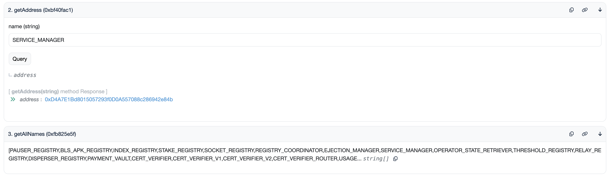

# Mainnet

## Quick Links

* [AVS Page][2]
* [Blob Explorer][1]
* [Deployed Contract Addresses][3]

## V1 Specs (Deprecated)

| Property | Value |
| --- | --- |
| Disperser Address | `disperser.eigenda.xyz:443` |
| DataAPI Address | `dataapi.eigenda.xyz` |
| Churner Address | `churner.eigenda.xyz:443` |
| Batch Confirmation Interval | Every 10 minutes (may vary based on network health) |
| Max Blob Size | 16 MiB |
| Stake Sync (AVS-Sync) Interval | Every 6 days |
| Ejection Cooldown Period | 3 days |

## Blazar (V2) Specs

| Property | Value |
| --- | --- |
| Disperser Address | `disperser.eigenda.xyz:443` |
| DataAPI Address | `dataapi.eigenda.xyz` |
| Churner Address | `churner.eigenda.xyz:443` |
| Batch Dispersal Interval | Every 1 second (may vary based on network health) |
| Min Blob Size | 128 KiB |
| Max Blob Size | 16 MiB |
| Stake Sync (AVS-Sync) Interval | Every 6 days |
| Ejection Cooldown Period | 3 days |

## Contract Addresses

| Contract | Address |
| --- | --- |
| EigenDADirectory | [0x64AB2e9A86FA2E183CB6f01B2D4050c1c2dFAad4](https://etherscan.io/address/0x64AB2e9A86FA2E183CB6f01B2D4050c1c2dFAad4) |

All other contracts are now tracked inside the EigenDADirectory contract:
1. Click on the etherscan link above.
2. Click on the "Contract" button.
3. Click on the "Read as Proxy" button.
4. Click on "getAllNames()" function to see the name of all registered contracts.
5. Use the "getAddress()" function to get the address of a specific contract, using its name.

## Quorums

| Quorum Number | Token |
| --- | --- |
| 0 | ETH, LSTs |
| 1 | [EIGEN](https://etherscan.io/address/0xec53bF9167f50cDEB3Ae105f56099aaaB9061F83) |
| 2 | [reALT](https://etherscan.io/address/0xF96798F49936EfB1a56F99Ceae924b6B8359afFb) |

[1]: https://blobs.eigenda.xyz/
[2]: https://app.eigenlayer.xyz/avs/0x870679e138bcdf293b7ff14dd44b70fc97e12fc0
[3]: https://github.com/Layr-Labs/eigenlayer-middleware/?tab=readme-ov-file#current-mainnet-deployment