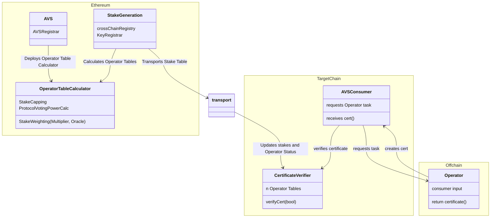

The Multichain Verification framework uses the core contracts and templates in EigenLayer middleware described in the table. 
These are not pluggable and are intended to interface with offchain, modular components. 

| Contract Name                 | Deployment Target     | Deployer                 | Description                                                                                                                                                                            |
|-------------------------------|-----------------------|--------------------------|----------------------------------------------------------------------------------------------------------------------------------------------------------------------------------------|
| **`KeyRegistrar`**            | Ethereum Singleton    | EigenLayer Core Protocol | Unified module for managing and retrieving BN254 and ECDSA cryptographic keys for Operators with built-in key rotation support, extensible to additional curves like BLS381            |
| **`CrossChainRegistry`**      | Ethereum Singleton    | EigenLayer Core Protocol | Manages AVS multichain configuration and tracks deployment addresses when using EigenLayer's generation and transport mechanisms                                                       |
| **`OperatorTableCalculator`** | Ethereum, One per AVS | AVS Middleware           | Required middleware contract deployed by an AVS for specifying stake weights per asset, or implementing custom logic like stake capping                                                |
| **`OperatorTableUpdater`**    | One per target chain  | EigenLayer Core Protocol | Parses and verifies the global Stake Table Root and rehydrates individual Operator tables in the `CertificateVerifier`                                                                 |
| **`CertificateVerifier`**     | One per target chain  | EigenLayer Core Protocol | Enables AVS consumers to verify tasks against operator sets using transported stake tables. The `CertificateVerifier` is the single integration point between AVSs and their consumers |

## CertificateVerifier 

The `CertificateVerifier` is the core contract that AVSs need to integrate with. It is the gateway to EigenLayer services (that is, where offchain services come onchain) and 
is deployed on every supported chain. 

The `CertificateVerifier` has a stable, chain-agnostic integration pattern. You interact with the same 
interface regardless of which chain you're deploying to, or which consumers are using your AVS. This enables a “code once, 
deploy everywhere” workflow that reduces cross-chain complexity, eases integration with other AVSs, and simplifies ongoing maintenance.

## Contract Interaction

The contracts interact as illustrated.

