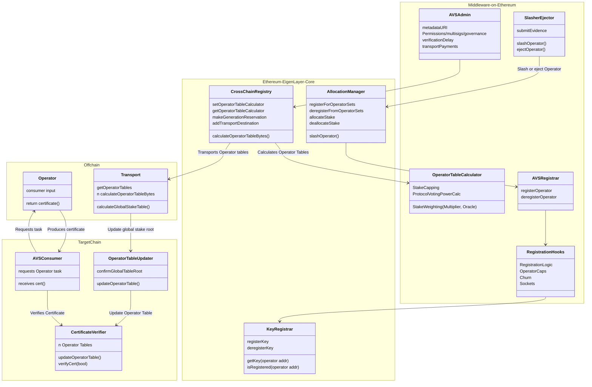

The Multichain Verification framework uses the core contracts and templates in EigenLayer middleware described in the table. 
These are not pluggable and are intended to interface with offchain, modular components. 

| Contract Name                 | Deployment Target              | Deployer                 | Description                                                                                                                                                                                      |
|-------------------------------|--------------------------------|--------------------------|--------------------------------------------------------------------------------------------------------------------------------------------------------------------------------------------------|
| **`CertificateVerifier`**     | One per target chain           | EigenLayer Core Protocol | Enables AVS consumers to verify certificates signed by Operators against transported Operator tables. The `CertificateVerifier` is the single integration point between AVSs and their consumers |
| **`KeyRegistrar`**            | Ethereum Singleton             | EigenLayer Core Protocol | Unified module for managing and retrieving BN254 and ECDSA cryptographic keys for Operators with built-in key rotation support, extensible to additional curves like BLS381                      |
| **`CrossChainRegistry`**      | Ethereum Singleton             | EigenLayer Core Protocol | Coordination contract that manages the registration and deregistration of Operator Sets to the multichain protocol and exposes read-only functions to generate the Operator Table.               |                            |
| **`OperatorTableCalculator`** | Ethereum, One per Operator Set | AVS Middleware           | Required middleware contract specified by an AVS (one per Operator Set) for calculating operator  weights, or customizable to decorate weights with custom logic such as stake capping           |
| **`OperatorTableUpdater`**    | One per target chain           | EigenLayer Core Protocol | Parses and verifies the global Stake Table Root and calculates individual Operator tables in the `CertificateVerifier`                                                                           |

## CertificateVerifier 

The `CertificateVerifier` is the core contract that AVSs need to integrate with, and consumers use to verify operator certificates against transported stake tables. 
It is the gateway to EigenLayer services (that is, where offchain services come onchain), is deployed on every supported target chain, and holds
the weight values from Ethereum for verifying Operator certificates. 

The `CertificateVerifier` has a stable, chain-agnostic integration pattern. You interact with the same 
interface regardless of which chain you're deploying to, or which consumers are using your AVS. This enables a "code once, 
deploy everywhere" workflow that reduces crosschain complexity, eases integration with other AVSs, and simplifies ongoing maintenance.

## KeyRegistrar

The `KeyRegistrar` manages cryptographic keys for Operators across different Operator Sets. It supports both ECDSA and BN254
key types and ensures global uniqueness of keys across all Operator Sets. The `KeyRegistrar` contract provides trusted, 
protocol-controlled code for AVSs to register Operator keys for Operator Sets. 

## CrossChainRegistry

The `CrossChainRegistry` is the core contract that manages the registration and deregistration of Operator Sets to the Multichain protocol. 
The `CrossChainRegistry` contract exposes read-only functions for calculating Operator Tables that are used offchain to generate
the global Stake Table. The `CrossChainRegistry` is the entrypoint for AVSs using the Multichain protocol, and houses configuration
of staleness periods, and specifies the `OperatorTableCalculator` used to define operator weights for each Operator Set.

## OperatorTableCalculator

The `OperatorTableCalculator` is an AVS-deployed contract (one per Operator Set) that can be used for decorating stake weights with custom logic. 
The contract interface allows AVSs to implement complex weighting features such as stake capping, differential asset weighting, 
oracle integrations, and minimum requirements. [Default templates](https://github.com/Layr-Labs/eigenlayer-middleware?tab=readme-ov-file#current-middlewarev2-testnet-deployment) that require no interaction or custom logic are provided for 
AVSs to specify as the `OperatorTableCalculator`.

## OperatorTableUpdater

The `OperatorTableUpdater` interfaces with offchain transport mechanisms. The `OperatorTableUpdater` confirms the data
that it receives from the global stake table and parses it into individual Operator Table updates on the `CertificateVerifier`. 
This enables accurate, timely updates for individual AVS's Operator Tables as Operators are slashed or ejected.

## Contract Interaction

The contracts interact as illustrated.

