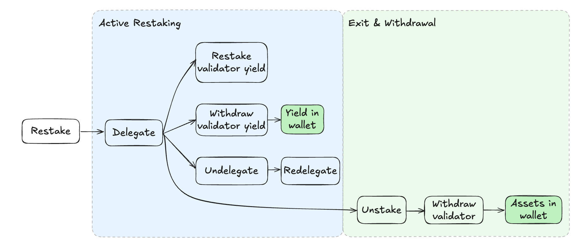

:::warning
Read the following subsections before launching your new validator or integrating your existing validator. 

Before you deploy a new validator you must plan to either:
- Initially provision the withdrawal credentials to your EigenPod address.
- Initially provision the withdrawal credentials to an 0x00 address. You can then later modify your withdrawal credentials to your EigenPod address.
:::

The diagram below outlines the operational flow of native restaking including: 
* Delegation 
* Redelegation (switching to a new Operator without exiting the validator)
* Yield handling options
* Exiting restaking.

